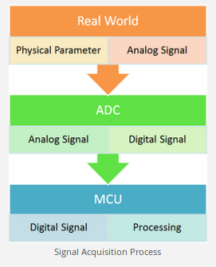
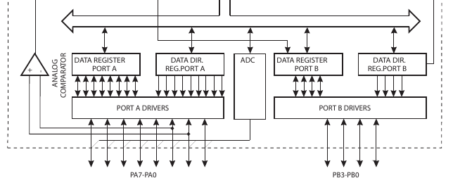
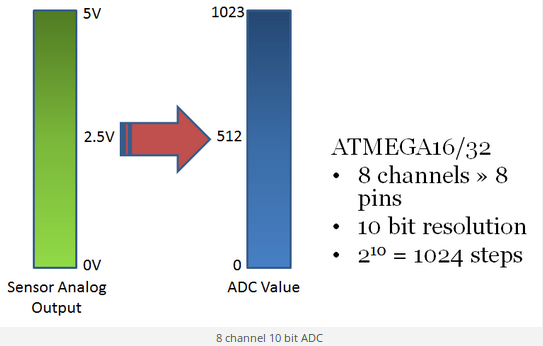
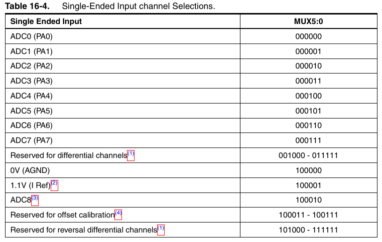
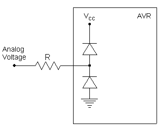

# Analog to Digital Converter (ADC)

* [Analog signals](#analog-signals)
* [ADC Prescaler](#adc-prescaler)
* [Conversion time](#conversion-time)
* [Selecting the channel(s)](#selecting-the-channels)
* [Modes of Operation & Starting the Conversion](#modes-of-operation--starting-the-conversion)
* [Beware the smoke](#beware-the-smoke)

## Analog signals

The microcontroller is a digital device so it can only read and write digital signals. In order to read real world analog signals, it has a piece of hardware called **analog to digital converter or ADC** which converts an continuous analog value into a discrete digital value.

In the attiny44, the ADC is hooked to PORTA (pins PA0 to PA7) only. You cannot read analog signals in PORT B.

It is a 10-bit ADC. That means it has a resolution of 2E10=1024. It has 8 channels through a multiplexer. That means you can convert up to 8 analog signals (not at the same time, of course).

* It has 12 differential ADC channel pairs with 1x/20x gain

## ADC Prescaler

The ADC of the AVR converts analog signal into digital signal at some regular interval. This interval is determined by the clock frequency. In general, the ADC input requires a frequency range of 50kHz to 200kHz. Out of this range of frequencies, which one do we choose? There is a trade-off between frequency and accuracy. The greater the frequency, the lesser the accuracy. So, if your application doesn’t require 10 bits of resolution, you could go for higher frequencies than 200KHz. In any case it is not recommended to go over 1MHz.

Since the CPU clock frequency is much higher (in the order of MHz), to achieve it, a frequency division must be applied. The prescaler acts as this division factor. It produces desired frequency from the external higher frequency. There are some predefined division factors: 2, 4, 8, 16, 32, 64, and 128. For example, a prescaler of 64 implies F_ADC = F_CPU/64. For F_CPU = 16MHz, F_ADC = 16M/64 = 250kHz.

You configure the division factor of the pre-scaler using the ADPS bits.

## Conversion time

The analog to digital conversion is not instantaneous, it takes some time. This time depends on the clock signal used by the ADC. The conversion time is proportional to the frequency of the ADC clock signal.

If you can live with 8-bit resolution, you can reduce the conversion time by increasing the ADC clock frequency.

To know the time that a conversion takes, just need to divide the number of ADC clock cycles needed for conversion by the frequency of the ADC clock. Normally, a conversion takes 13 ADC clock cycles. The first conversion after the ADC is switched on (by setting the ADEN bit) takes 25 ADC clock cycles. This first conversion is called an "Extended Conversion". For instance, if you are using a 200kHz ADC clock signal, a normal conversion will take 65 microsenconds (13/200e3=65e-6), and an extended conversion will take 125 microseconds (25/200e3=125e-6).

## Selecting the channel(s)

You can select the input channel using the ADMUX register bits 4:0

Using this table:

So if we want to activate ADC6 in PA6 we do:

`ADMUX |= (1<<MUX2 | 1<<MUX1)`

The reference voltage is selected configuring the bits REFS1 and REFS0 according to this table. By default is set to use VCC:

 
## Modes of Operation & Starting the Conversion

The ADC has **two** fundamental operation **modes**: **Single Conversion** and **Free Running**. In Single Conversion mode, you have to initiate each conversion. When it is done, the result is placed in the ADC Data register pair and no new conversion is started. In Free Runing mode, you start the conversion only once, and then, the ADC automatically will start the following conversion as soon as the previous one is finished.

ADCSRA |= (1 << ADFR);

## Beware the smoke

You MUST respect the voltage range allowed for the AVR pins (see Maximum Absolute Ratings in the Electrical Characteristics section of the datasheet). The voltage must be below VCC+0.5V and above -1V. If you don't respect this, you will blow your AVR. Be sure that the analog signals you are using are in the right range. If they come from the external world, is a good idea to use some kind of protection at the input. See the suggested circuit below (which consists of just one resistor...).

 

 This circuit uses the internal clamping diodes present in all AVR I/O pins. If the analog voltage is higher than Vcc plus the conduction voltage of the diode (around 0.5V), the upper diode will conduct and the voltage at the input pin is clamped to Vcc+0.5 . On the other hand, if the analog voltage is lower than 0V minus the conduction voltage of the diode, the lower diode will conduct, and the voltage at the input pin is clamped to –0.5V. The resistor will limit the current through the conducting diode, which must not exceed 1mA, so you must design the resistor accordingly. For instance, if you expect that the maxim value that may reach the analog voltage is ±24V, the resistor value should be :

R=24V/1mA=24K.
