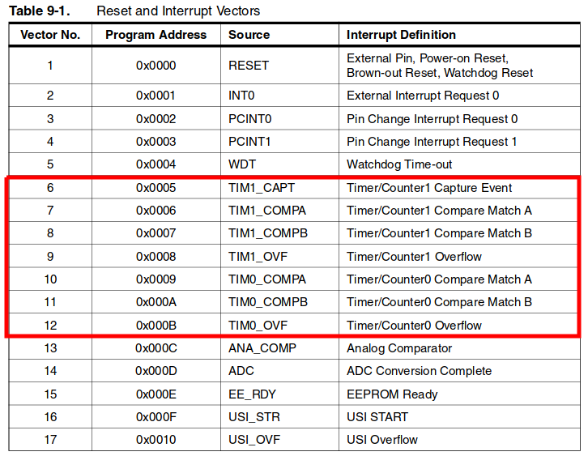

# Timer Interrupts

* [Understanding timer interrupts](#understanding-timer-interrupts)
* [Activating timer interrupts](#activating-timer-interrupts)
* [Setting the mode of operation](#setting-the-mode-of-operation)
* [The interrupt routine ISR](#the-interrupt-routine-isr)
* [Worked Example](#worked-example)

## Understanding timer interrupts

In the last chapter we learned about the [timer counter](timercounter.md) and the required registers to make it work. 

We also had learned before about [interrupts](interrupts.md). An interrupt is an event that occurs when a particular trigger (either from an internal or external source) happens. The interrupt allows the program to stop what it was doing, perform a short task, and then return to where it left off in the main program.

Today we will learn about interrupts associated with timers. Timers can generate interrupts when they overflow or reach certain value. That will be very helpful to make our program to execute a task at regular intervals of time while executing at the same time other tasks.

## Activating timer interrupts

To enable timer interrupts, first we have to include the interrupt library and enable global interrupts

```C
#include <avr/interrupt.h>
sei();
```

## Setting the mode of operation

Next thing we have to do is set the **mode of operation**. When will the interrupt be triggered? There is a dedicated register where we can specify that. Remember that there are 2 timers, a 8-bit and a 16-bit. For `TIMER0` (8-bit) we have:


* Setting `TOIE0` bit will enable the interrupt in normal mode of operation. That means, the interrupt will be triggered when the counter overflows.
* Setting `OCIE0A` bit will enable the interrupt in CTC mode of operation when `TCNT0=OCR0A`. That is, when the counter `TCNT0` reaches a certain value (`OCR0A`) that we have decided beforehand.
* Similarly, setting `OCIE0B` bit will enable the interrupt in CTC mode of operation when `TCNT0=OCR0B`.

## The interrupt routine ISR

As we saw before, the interrupt routine needs to have a specific name called vector. And these are the attiny44 vectors associated with timer interrupts:



## Worked Example

In this example we are going to consider all the above to set up a 1 second timer on an attiny44 microcontroller with an external 20MHz clock source. So first thing is activating global interrupts:

```C
sei();
```

At 20Mhz, a clock cycle is 50ns. We will count time using `TIMER1` (the 16-bit timer). Counting to 65535 at this speed with take exactly 3.277ms. That is definitely too fast for our purpose. 

So we will have to trigger the timer with a **prescaler** value (by setting the Clock Select bits `CS12:10`) in Timer/Counter1 Control Register B (`TCCR1B`). This allows us to slow down the timer by a factor of 1, 8, 64, 256 or 1024 compared with the clock source. However, it is unlikely that counting to 65535 at any of these speeds with take exactly one second as we see in the table below:

| Pre-scaler value | Time       |
| ---------------- | ---------- |
| 1                | 3.277 ms   |
| 8                | 26.216 ms  |
| 64               | 209.728 ms |
| 256              | 838.912 ms |
| 1024             | 3.355392 s |

We see that we will have to **set the pre-scaler to 1024** in order to be able to count at least a second.

But what number shall we count up to? As you see in the table above, counting to 65535 at this speed would take 3.355392 seconds. Therefore 1 second will take 65535/3.355392=19531.25 increments. To set this as the maximum the timer should count to, we set Output Compare Register 1 A (`OCR1A`) to 19531.

```C
OCR1A   = 19531; // set the CTC compare value
```

Next thing is setting the timer to CTC (Clear Timer on Compare) mode. To use this mode, the Waveform Generation Mode bits (`WGM13:10`) in `TCCR1A` and `TCCR1B` must be set accordingly.

```C
TCCR1B |= (1 << WGM12); // configure timer1 for CTC mode
```

> **Think about it:** As you can see, 1 second is 19531.25 clock cycles. But actually, we are counting 19531 clock cycles. Can you derive how much this count will be off after a year?

Let's set the **interrupt**. To ensure that a signal is received when the timer reaches 1 second, the Timer/Counter1 Output Compare A Match interrupt (`OCIE1A`) bit must be set in the Timer/Counter1 Interrupt Mask Register (`TIMSK1`).

```C
TIMSK1 |= (1 << OCIE1A); // enable the CTC interrupt
```

Finally we have to set the ISR routine. In this case setting the `OCIE1A` bit corresponds to the `TIM1_COMPA_vect` Interrupt Service Routine.

```C
ISR(TIM1_COMPA_vect) {
  // here the routine that
  // toggles the LED
}
```

> **Learn by doing:** Write the routine that toggles the LED

That was everything required to prepare the timer and the interrupt, so the only thing remaining is triggering it. Remember that the timer will start as soon as we set the pre-scaler:

```c
TCCR1B |= ((1 << CS10) | (1 << CS12)); // start the timer   at 20MHz/1024
```

> **Learn by doing:** Write another routine that toggles the LED every minute.
