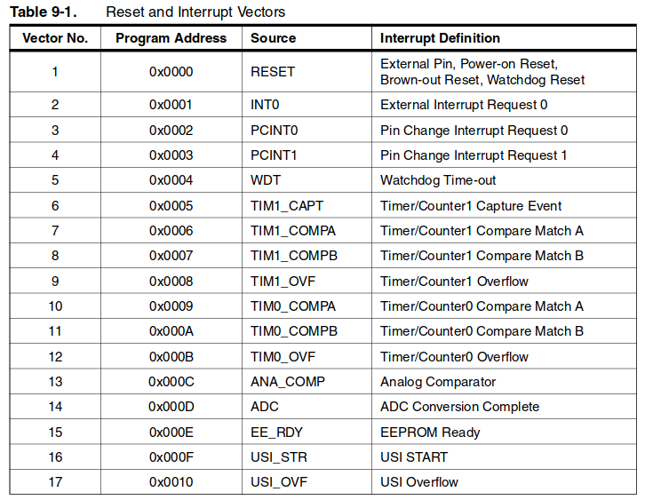

# Timer Interrupts

* [Example: Set 1 second timer using Timer Interrupts](#example-set-1-second-timer-using-timer-interrupts)

Timers can generate interrupts when they overflow or reach certain value, which is how they can interact with your program. As we saw [before](interrupts.md), an interrupt is an event that occurs when a particular trigger (either from an internal or external source) happens. The interrupt allows the program to stop what it was doing, perform a short task, and then return to where it left off in the main program. To enable timer interrupts, first we have to include the interrupt library and enable global interrupts

`sei();`

Then we have to mask which interrupt we want to trigger. For TIMER0 we have:


* Setting **TOIE0** bit will enable the interrupt in normal mode of operation
* Setting **OCIE0A** bit will enable the interrupt in CTC mode of operation when **TCNT0=OCR0A**
* Setting **OCIE0B** bit will enable the interrupt in CTC mode of operation when **TCNT0=OCR0B**

And these are the corresponding vectors:



## Example: Set 1 second timer using Timer Interrupts
In this example we are going to consider all the above to set up a 1 second timer on an attiny44 microcontroller with an external 20MHz clock source using TIMER1 (the 16-bit timer).

At 20Mhz, a clock cycle is 50ns. Counting to 65535 at this speed with take exactly 3.277ms. So we will have to trigger the timer with a prescaler value (by setting the Clock Select bits CS12:10) in Timer/Counter1 Control Register B (TCCR1B). This allows us to slow down the timer by a factor of 1, 8, 64, 256 or 1024 compared with the clock source. However, it is unlikely that counting to 65535 at any of these speeds with take exactly one second as we see in the table below:

| Pre-scaler value | Time       |
| ---------------- | ---------- |
| 1                | 3.277 ms   |
| 8                | 26.216 ms  |
| 64               | 209.728 ms |
| 256              | 838.912 ms |
| 1024             | 3.355392 s |

We see that we will have to set the pre-scaler to 1024 in order to be able to count at least a second.

Now need to calculate what number must be counted to with this pre-scaler value, and make the timer overflow when it hits that number. This is CTC (Clear Timer on Compare) mode. To use this mode, the Waveform Generation Mode bits (WGM13:10) in TCCR1A and TCCR1B must be set accordingly.

`TCCR1B |= (1 << WGM12); // configure timer1 for CTC mode`

To ensure that a signal is received when the timer overflows, the Timer/Counter1 Output Compare A Match interrupt (OCIE1A) bit must be set in the Timer/Counter1 Interrupt Mask Register (TIMSK1) and global interrupts have to be enabled.

```
TIMSK1 |= (1 << OCIE1A); // enable the CTC interrupt
sei();
```
So what number shall we count to? As you see in the table above, counting to 65535 at this speed would take 3.355392 seconds. Therefore 1 second will take 65535/3.355392=19531.25 increments. To set this as the maximum the timer should count to, we set Output Compare Register 1 A (OCR1A) to 19531.

`OCR1A   = 19531; // set the CTC compare value`

That was everything required to prepare the timer, so the only thing remaining is triggering it:

`TCCR1B |= ((1 << CS10) | (1 << CS12)); // start the timer   at 20MHz/1024`

Finally we have to set the ISR. In this case setting the OCIE1A bit corresponds to the TIM1_COMPA_vect Interrupt Service Routine.
```C
ISR(TIM1_COMPA_vect) {
  // here the routine
}
```
Inside this routine, we can toggle the LED.
