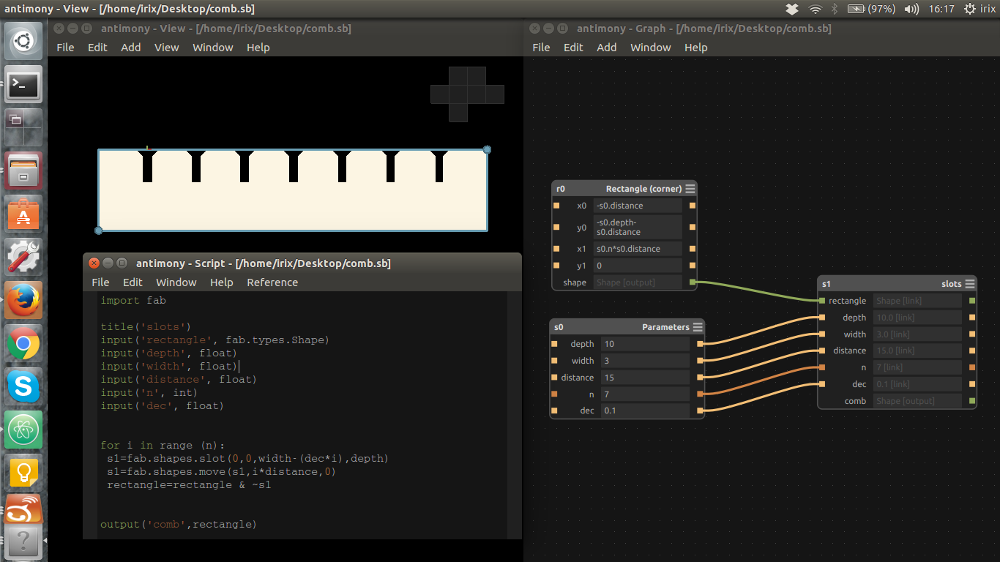

# Creating a parametric _comb_ in kokopelli and antimony

* [In kokopelli](#in-kokopelli)
* [In antimony](#in-antimony)

A _comb_ is something very useful to cut when you are doing press-fit designs. It helps you to select the correct size of the slot.

## In kokopelli

kokopelli first, because it's my favourite software.


And this is the script, which you can also download [here](./files/comb.ko)

```python
from koko.retro.lib.shapes import *

# Render boundaries
cad.xmin = -1
cad.xmax = 1
cad.ymin = -1
cad.ymax = 1
cad.mm_per_unit = 1 # mm units

# Parameters
depth=10.
width=3.
distance=15.
n=7
dec=0.1 # decrement in mm

# Draw
r1=rectangle(-distance,n*distance,-depth-distance,0)

for i in range (n):
 s1=slot(0,0,width-(dec*i),depth)
 s1=move(s1,i*distance,0)
 r1=r1-s1

cad.function = r1
```

## In antimony

I found this a little bit tricky, but here you are. Also you can also download the file [here](./files/comb.sb).



The node _slots_ has this script inside.

```python
import fab

title('slots')
input('rectangle', fab.types.Shape)
input('depth', float)
input('width', float)
input('distance', float)
input('n', int)
input('dec', float)

for i in range (n):
 s1=fab.shapes.slot(0,0,width-(dec*i),depth)
 s1=fab.shapes.move(s1,i*distance,0)
 rectangle=rectangle & ~s1

output('comb',rectangle)
```

---
[Back to Summary](../summary.md)
