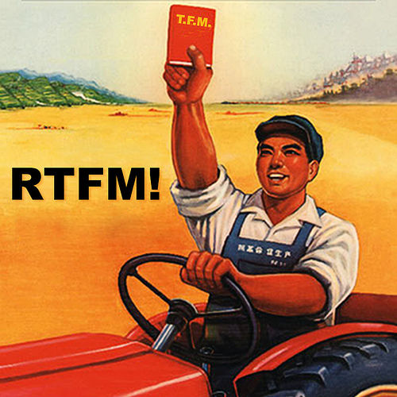
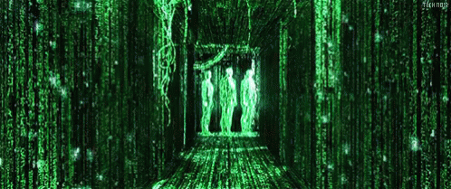

# Parametric CAD II. OpenSCAD

## Introduction to OpenSCAD
[OpenSCAD](http://www.openscad.org/) is a free **script based** application for creating solid 3D CAD objects.
> Install OpenSCAD in your computer

It has a specific [description language](https://en.wikibooks.org/wiki/OpenSCAD_User_Manual/The_OpenSCAD_Language) which specifies geometric primitives and defines how they are modified to render a 3D model. No one likes manuals, but you have to read the manual sometimes.  


## Seeing the Matrix
Script based CAD software like OpenSCAD has a number of advantages over traditional and more intuitive *click and drag* software.

> Name a few advantages of script based CAD software. Can you imagine any disadvantage also?

It also helps you develop some personal skills like abstraction, rigor and spatial vision. In fact, when you master OpenSCAD you will see like this:



## Commenting the code
In all code, commenting is very important. OpenSCAD uses C style comments.

`// This is a single line comment in C and also OpenSCAD`

```
/*
And this is a multiple
line comment in C and
also in OpenSCAD
*/
```

Not only comment every step you do (so others can learn from you) but also **include a header in every file** with the following information:

* filename
* short description
* your name (author)
* date
* license and credits

You will greatly appreciate that info when you or others open the file later in the future.

## Hello-world cube
The [Hello-world](https://en.wikipedia.org/wiki/%22Hello,_World!%22_program) of OpenSCAD is a cube.

`cube(size=[x,y,x]);` creates a cube with one corner on the origin and x,y,z dimensions like `cube([10,20,30]);`

> [Why](https://en.wikibooks.org/wiki/OpenSCAD_User_Manual/The_OpenSCAD_Language#cube) did the above code work if `size=` was omitted? Create a 15x15x15 cube centered in the origin.

## Translations and rotations

Rotations are about an axis using the [right hand rule](https://en.wikipedia.org/wiki/Right-hand_rule).

## Cylinders, polygons and piramids
## Unions and diferences
## Defining parameters
## Creating modules
## Default parameters
## Grids and Arrays
## Adding color and modifiers
## Calling other files
## The incredible hull
## Assemblies using equations
## Cheatsheet
---
[Back to Summary](../summary.md)
